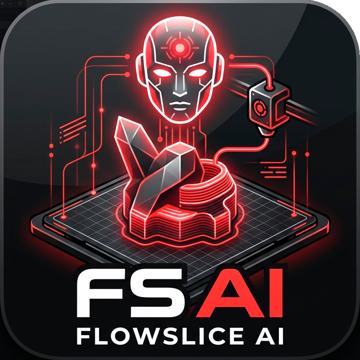
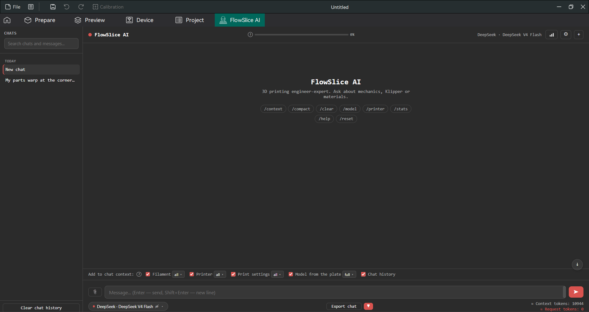
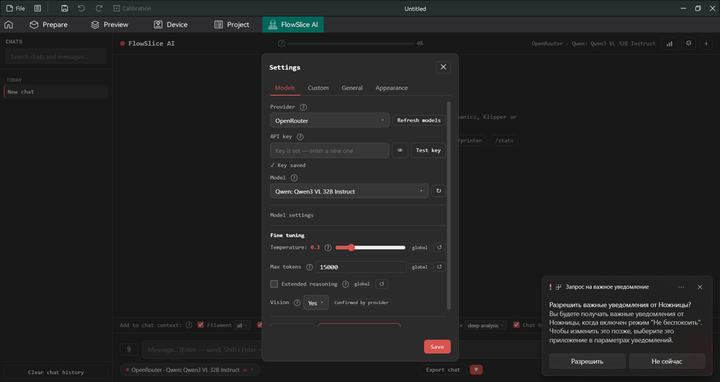
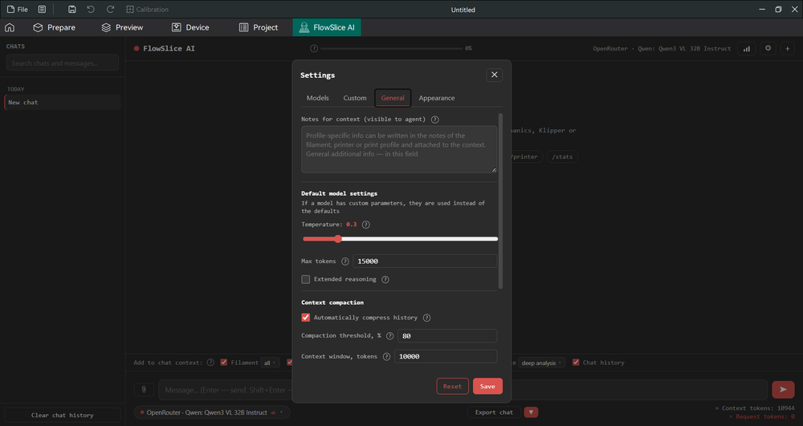
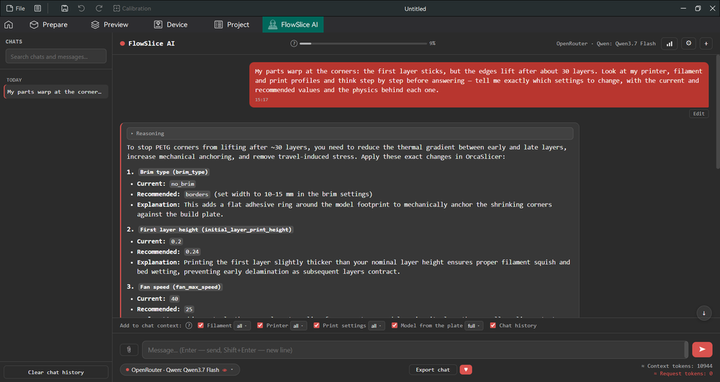

# FlowSlice AI

<p align="center">
  
</p>

<p align="center">
  <b>ИИ-инженер 3D-печати прямо внутри Orca Slicer.</b><br>
  Видит вашу модель, профили и историю печати и помогает с механикой, Klipper и тонкой настройкой материалов.
</p>

<p align="center">
  <a href="https://github.com/OrcaSlicer/OrcaSlicer"></a>
  <a href="https://www.python.org/"></a>
  <a href="https://github.com/FlowHack/flowslice-ai/actions/workflows/ci.yml"></a>
  
</p>

---

## 📖 Содержание

- [Что это такое](#-что-это-такое)
- [Возможности](#-возможности)
- [Установка](#-установка)
- [Быстрый старт для новичков](#-быстрый-старт-для-новичков)
- [Где взять API-ключ](#-где-взять-api-ключ)
- [Настройки](#-настройки)
- [Синхронизация каталога моделей](#-синхронизация-каталога-моделей)
- [Контекст слайсера](#-контекст-слайсера)
- [Вложения и лимиты](#-вложения-и-лимиты)
- [Команды](#-команды)
- [Приватность и данные](#-приватность-и-данные)
- [Частые вопросы](#-частые-вопросы)
- [Разработка](#-разработка)
- [Обратная связь](#-обратная-связь)
- [Лицензия](#-лицензия)

---

## 🤖 Что это такое

**FlowSlice AI** — это плагин-ассистент для [Orca Slicer](https://github.com/OrcaSlicer/OrcaSlicer).
Он добавляет отдельную вкладку с чатом, в котором отвечает ИИ-инженер по 3D-печати. В отличие от
обычного чат-бота, ассистент **видит контекст вашего слайсера**: какая модель стоит на столе, какие
включены профили принтера, пластика и печати, какие у них параметры и заметки.

Спросите его — и получите ответ по делу, с учётом именно вашего оборудования и материала, а не
абстрактные общие советы.

> 💡 **Пример.** «Почему по углам детали появляется вздутие, у меня PETG и принтер Ender-3?» —
> ассистент увидит ваш профиль, температуру, скорость и поток и даст конкретные значения для правки.

---

## ✨ Возможности

<table>
<tr>
<td width="50%" valign="top">

### 💬 Чат
- Стриминг ответов (SSE) — текст появляется по мере генерации
- Размышления reasoning-моделей: раскрывающиеся блоки, раскрыты во время стрима и сворачиваются
  после ответа (шеврон, красная подсветка live) — OpenRouter, DeepSeek, Anthropic
- Остановка генерации: если ответ пуст, он помечается как прерванный пользователем; уже полученный
  текст сохраняется как есть
- Регенерация последнего ответа
- Редактирование и повторная отправка любого своего сообщения (edit & resend)
- Варианты ответов с переключением между ними

### 🗂 Мультичат
- Неограниченное число диалогов
- Автоматические названия по первому вопросу
- Поиск по истории чатов
- Закрепление важных чатов
- Сохранение истории между запусками
- История одного чата — до 200 сообщений
- Выбранная модель запоминается за чатом и восстанавливается при перезапуске; под ответом — сноска
  с моделью, сгенерировавшей этот ответ

</td>
<td width="50%" valign="top">

### 🧠 Контекст слайсера
- Модель на столе: габариты, объём, площадь, треугольники, положение, целостность меша (manifold)
- Профили принтера, пластика и настроек печати
- Полный дамп параметров или только изменённые
- Человекочитаемые локализованные названия параметров, например «Тип каймы (brim_type)»: 823 настройки OrcaSlicer, 753 перевода ru
- Заметки профилей и start/end G-code
- Чекбоксы контекста прямо в панели чата

### 🔌 Провайдеры и модели
- 11 встроенных провайдеров «из коробки»
- Свои OpenAI/Anthropic-совместимые провайдеры
- Избранные модели: закреплённая группа «Избранное» и кнопка ♥; выбор сохраняется между запусками
- Синхронизация каталога моделей: кнопка «Обновить модели» и автообновление
- Поиск моделей не зависит от порядка слов (находит id с «/» и «:» и версии вида 3.7)
- Тонкая настройка каждой модели: температура, макс. токенов, режим мышления, поддержка изображений
- Модель по умолчанию — звёздочка в списке моделей
- Точный usage и стоимость: `stream_options.include_usage` с авто-фолбэком при HTTP 400. Токены
  берутся из usage провайдера, когда он его отдаёт (OpenRouter — вместе с реальным `cost`, Anthropic
  — точные токены), иначе оцениваются. Стоимость показывается, только когда известны обе цены
- Статистика использования (📊)

</td>
</tr>
</table>

- **Вложения:** фотографии (до 4 МБ на клиенте, сжимаются до 1024 px) и текстовые файлы (до 100 000 символов каждый, до 400 000 суммарно).
- **Локализация:** English / Русский / Српски (по умолчанию английский).
- **Темы:** авто (нативная Orca) / светлая / тёмная (чистые белый `#ffffff` и чёрный `#000000`),
  фирменный красный акцент `#d9534f`.
- **Поддержка проекта:** необязательный виджет ♥ в окне чата с актуальными реквизитами (YoMoney, USDT TRC-20, BTC) и кнопкой копирования.

---

## 📸 Скриншоты

<p align="center">
  <sub>Главный экран:</sub>
  <br>
</p>

<p align="center">
  <sub>Настройки, вкладка «Модели»: провайдеры, API-ключи и параметры моделей (температура, токены, мышление, зрение):</sub>
  <br>
</p>

<p align="center">
  <sub>Настройки, вкладка «Общие»: заметки для контекста, дефолтные параметры моделей, сжатие контекста, автообновление провайдеров и сброс данных:</sub>
  <br>
</p>

<p align="center">
  <sub>Пример работы чата:</sub>
  <br>
</p>

---

## 📦 Установка

### Способ 1. Через OrcaCloud (рекомендуется)

1. Оформите подписку на **FlowSlice AI** в OrcaCloud.
2. После подписки плагин появится в Orca Slicer в разделе **File → Plugins** — установите его.
3. Включите переключатель **FlowSlice AI** в списке плагинов.
4. Откройте вкладку **FlowSlice AI**. Если вкладка не появилась — перезапустите Orca Slicer.

### Способ 2. Локальная установка `.whl` (для разработки)

1. Скачайте файл `flowslice_ai-<версия>-py3-none-any.whl` со страницы
   [**Releases**](https://github.com/FlowHack/flowslice-ai/releases) (тег `v0.1.0`).
2. Откройте Orca Slicer и перейдите в **File → Plugins → Install local plugin**.
3. Выберите скачанный `.whl`-файл и подтвердите установку.
4. Перезапустите Orca Slicer и включите **FlowSlice AI** в списке плагинов, если вкладка не появилась сразу.

> ⚠️ Для локальной установки нужен именно `.whl`-файл. Отдельные `.py`-версии не поддерживаются.

---

## 🚀 Быстрый старт для новичков

Никогда не работали с ИИ-чатами и API? Следуйте шагам — это займёт пару минут.

### Шаг 1. Откройте вкладку плагина
После установки найдите в Orca Slicer вкладку **FlowSlice AI** и откройте её.

### Шаг 2. Получите API-ключ
Выберите любого провайдера из [таблицы ниже](#-где-взять-api-ключ), зарегистрируйтесь и создайте
API-ключ. Это бесплатно на старте — почти все провайдеры дают пробный лимит.

### Шаг 3. Внесите ключ в плагин
1. Нажмите кнопку **Настройки** (шестерёнка) в окне чата.
2. Откройте вкладку **Модели**.
3. В выпадающем списке **Провайдер** выберите провайдера, чей ключ вы получили.
4. Вставьте ключ в поле **API-ключ**. Кнопка с глазиком покажет скрытый текст.
5. Выберите **Модель** из списка.
6. Нажмите **Сохранить**.

> 🔰 **Совет новичку.** Для первого запуска удобно взять **OpenRouter** — один ключ даёт доступ
> сразу ко многим моделям разных производителей. Роутеры `Auto`, `Auto (beta)` и `Free` сами
> подберут подходящую модель.

### Шаг 4. Задайте первый вопрос
Напишите сообщение в поле ввода и нажмите **Enter**. Например:

- «Проверь мои настройки печати PETG и скажи, что можно улучшить.»
- «Почему первый слой плохо прилипает?»
- «Что такое Pressure Advance и как его настроить на Klipper?»
- «Сравни TPU и PETG для гибких деталей.»
- «Порекомендуй температуру сопла и стола для моего пластика.»

### Шаг 5. Управляйте контекстом
В панели чата есть чекбоксы **Пластик**, **Принтер**, **Настройки печати**, **Модель со стола**
и **История чата**. Отметьте то, что ассистент должен учитывать. Рядом с каждым профилем есть
выпадающий список:

- **изм.** — отправить только параметры, которые вы изменили (экономит токены);
- **все** — отправить полный профиль целиком.

Для модели доступен свой выбор: **кратко**, **подробно** (полные метрики) и **глубокий анализ**
(дополнительные геометрические метрики).

Нажмите **Enter** для отправки и **Shift+Enter** для переноса строки.

### Шаг 6. Готово!
Пользуйтесь чатом как обычным мессенджером. История сохраняется, можно создавать новые чаты,
искать по ним и закреплять нужные.

---

## 🔑 Где взять API-ключ

Все ключи создаются в личных кабинетах провайдеров. Поле **API-ключ** находится в
**Настройки → Модели**.

| Провайдер | Где получить ключ | Примечание |
| --- | --- | --- |
| **DeepSeek** | https://platform.deepseek.com/api_keys | недорого, хорош для текста |
| **OpenRouter** | https://openrouter.ai/keys | один ключ — много моделей, есть бесплатные |
| **Google Gemini** | https://aistudio.google.com/app/apikey | есть бесплатный лимит |
| **Anthropic** | https://console.anthropic.com/settings/keys | модели Claude |
| **OpenAI** | https://platform.openai.com/api-keys | модели GPT |
| **Groq** | https://console.groq.com/keys | очень высокая скорость |
| **Zhipu GLM** | https://open.bigmodel.cn/ | модели GLM |
| **Cerebras** | https://cloud.cerebras.ai/ | быстрый инференс |
| **Mistral** | https://console.mistral.ai/api-keys | модели Mistral |
| **xAI** | https://console.x.ai/ | модели Grok |
| **NordRouter** | https://nordrouter.com/ | OpenAI-совместимый агрегатор, публичный прайс |

> 🔒 Ключ хранится локально в настройках плагина Orca Slicer и отправляется только на сервер
> выбранного вами провайдера. Плагин не пересылает его третьим лицам.

---

## ⚙️ Настройки

Настройки открываются шестерёнкой в окне чата и разбиты на четыре вкладки.

| Вкладка | Что настраивается |
| --- | --- |
| **Модели** | Провайдер, API-ключ, модель, температура, максимум токенов, режим мышления, признак поддержки изображений. Кнопки **Обновить модели** и **Удалить выбранную модель** — рядом. |
| **Персональные** | Свои OpenAI/Anthropic-совместимые провайдеры и модели: имя провайдера, базовый URL, схема API, API-ключ, название и идентификатор модели, а также температура / токены / мышление / зрение / цены. |
| **Общие** | Заметки для контекста, общие температура / максимум токенов / режим мышления по умолчанию; блок **сжатия контекста** (`compact_enabled`, порог в процентах, размер окна, число фото из истории); автообновление провайдеров (`auto_sync_providers`); сброс моделей. |
| **Оформление** | Тема (авто / светлая / тёмная), размер шрифта (10–20) и стиль (системный / моноширинный / с засечками), язык интерфейса. |

- Значения модели можно настраивать индивидуально; если оставить поле пустым — наследуются общие
  (по умолчанию `temperature = 0.3`, `max_tokens = 8192`, режим мышления выключен). При включённом
  режиме мышления наследуемый лимит токенов поднимается минимум до `16384`, чтобы модели хватило
  места на рассуждения; если у модели задан собственный `max_tokens`, он не увеличивается.
- Цены входа и выхода задаются у персональных моделей и используются для показа стоимости ответа;
  стоимость появляется, только когда известны обе цены.
- Кнопка **Сбросить** действует только на текущую вкладку (на вкладках «Модели» и «Персональные»
  она скрыта).
- На вкладке «Общие» есть **Сброс моделей** и **Сброс персональных моделей**.
- Изменения применяются только после нажатия **Сохранить**.

---

## 🔄 Синхронизация каталога моделей

- Кнопка **Обновить модели** есть у каждого провайдера. Она подгружает полный список моделей
  провайдера в сессионный кэш — конфиг при этом не раздувается, новые модели не добавляются.
  Обновляются названия, цены и признак поддержки изображений у уже существующих моделей.
- Чекбокс **Автообновление провайдеров** (`auto_sync_providers`) включён по умолчанию. Синхронизация
  запускается лениво — при построении списка провайдеров в UI, а также после сохранения API-ключа
  (для этого провайдера). Автообновление обходит провайдеров с ключом и всегда OpenRouter и
  NordRouter.
- **Цены** берутся у конкретного провайдера: у OpenRouter — собственный pricing из его каталога,
  у NordRouter — публичный прайс-лист; для остальных цены вводятся вручную.
- **Поддержка изображений** определяется из собственных каталогов, когда провайдер их отдаёт
  (Google, Anthropic, Mistral, xAI), иначе — по каталогу OpenRouter с учётом префикса провайдера.
- При добавлении или импорте модели метаданные сразу запрашиваются у провайдера.
- Ручные значения, а также `temperature` / `max_tokens` / `reasoning` автосинхронизация **не
  перезаписывает**.

---

## 🧠 Контекст слайсера

Панель контекста в чате определяет, что именно ассистент узнает о вашем проекте:

| Чекбокс | Что передаёт |
| --- | --- |
| **Модель со стола** | Габариты, объём, площадь поверхности, число треугольников, положение на столе, целостность меша (manifold), количество экземпляров. |
| **Пластик** | Профиль филамента: материал, температуры, поток, охлаждение и заметки. |
| **Принтер** | Профиль принтера: кинематика, сопло, стол, ограничения и start/end G-code. |
| **Настройки печати** | Профиль процесса: слои, периметры, заполнение, скорости, поддержки. |
| **История чата** | Предыдущие сообщения текущего чата. |

Для профилей доступны два режима выгрузки: **изм.** (только изменённые относительно базового
пресета параметры) и **все** (полный профиль). Для модели — три режима: **кратко**, **подробно** и
**глубокий анализ**. Выбранные чекбоксы и режимы запоминаются для чата.

Перед отправкой ключи параметров обогащаются метками интерфейса, поэтому модель называет их так, как
они подписаны в OrcaSlicer, например «Тип каймы (brim_type)». Словарь охватывает 823 настройки,
из них 753 переведены на русский; для сербского языка метки пока берутся из английской таблицы.

---

## 📎 Вложения и лимиты

- **Фотографии:** можно прикрепить снимок дефекта печати или детали. Изображение сжимается до
  1024 px (JPEG) и передаётся только моделям с поддержкой изображений. Клиентский лимит — 4 МБ на
  изображение, серверный — 6 МБ base64. Если выбранная модель их не поддерживает, плагин сообщит
  об этом и не станет отправлять файл.
- **Текстовые файлы:** содержимое файла (до 100 000 символов на файл, до 400 000 символов суммарно)
  добавляется в сообщение как обычный текст, поэтому работает с любой моделью.
- **Количество:** до 10 вложений в сообщении, из них до 10 изображений в одном запросе; суммарный
  размер изображений в запросе — до 20 МБ base64.

> Для распознавания фото выбирайте модели с поддержкой изображений, например через OpenRouter
> (`Auto`, `Free` или конкретную vision-модель).

### Лимиты и автосжатие

| Параметр | Значение |
| --- | --- |
| Вложений в сообщении | до 10 |
| Изображений в запросе | до 10; суммарно до 20 МБ base64 |
| Размер одного изображения | 1024 px, JPEG; клиент — 4 МБ, сервер — 6 МБ base64 |
| Текстовое вложение | 100 000 символов; 400 000 символов суммарно |
| Фото из истории | до 2 (настраивается на вкладке «Общие») |
| История одного чата | до 200 сообщений; при сохранении длинные текстовые вложения обрезаются |
| Контекстное окно | 128 000 токенов |
| Автосжатие истории | при достижении 80 % окна (отключается в настройках) |

---

## ⌨️ Команды

Введите команду в поле чата и нажмите **Enter**.

| Команда | Описание |
| --- | --- |
| `/context` | Показать фактический список сообщений, который уйдёт модели (полный системный промпт, история, изображения кратко), и оценку числа токенов этого запроса |
| `/compact` | Сжать историю чата в короткую сводку (вручную) |
| `/clear` | Очистить текущий чат |
| `/model` | Показать отчёт о модели на столе |
| `/printer` | Показать сводку профилей печати с человекочитаемыми названиями параметров |
| `/stats` | Показать статистику использования |
| `/help` | Список команд |
| `/reset` | Сбросить настройки плагина (`/reset chats` — очистить чаты) |

**Горячие клавиши:** `Enter` — отправить, `Shift+Enter` — новая строка.

---

## 🔐 Приватность и данные

Плагин работает по принципу «отправляется только то, что нужно для ответа». Ниже — что именно
уходит модели, а что остаётся на вашем компьютере.

### Что отправляется провайдеру ИИ

- Текст ваших сообщений и история текущего чата — в объёме, который вы включили в контекст.
- Данные слайсера, отмеченные чекбоксами в панели чата:
  - параметры профилей (только изменённые относительно базового пресета либо все — по вашему выбору);
  - заметки профилей и start/end G-code, если соответствующие разделы включены;
  - статистика модели: габариты, объём, площадь поверхности, число треугольников, позиция, целостность
    сетки (manifold), число экземпляров; в режиме анализа `deep` — дополнительные геометрические метрики.
- Прикреплённые вами фотографии (сжимаются до 1024 px) и текстовые файлы.
- Системная инструкция плагина и выбранные реквизиты запроса.

### Что НЕ отправляется

- **Файл модели никогда не покидает ваш компьютер.** Передаются только вычисленные числовые
  статистики, а не сама геометрия или файл.
- **Учётные данные принтера** (`print_host`, `print_host_webui`, `printhost_apikey`,
  `printhost_user`, `printhost_password`, `printhost_cafile` и любые ключи, содержащие
  `password`, `apikey`, `secret`, `token`) отсекаются на этапе сбора данных — в том числе в режиме
  «все параметры».
- **API-ключи провайдеров** не отправляются модели и не сохраняются в истории чатов.
- Нет телеметрии, аналитики, регистрации и «домашних» серверов.

### Где что хранится

- **API-ключи** — в конфигурации плагина Orca Slicer на вашем компьютере; передаются только на
  сервер выбранного вами провайдера по HTTPS.
- **История чатов** — локально, в `data_dir()/flowslice_ai/chats.json`; очистить можно командой
  `/clear` или удалением чата.
- **Настройки и статистика использования** — локально, через официальное API конфигурации Orca Slicer.

### Сетевые запросы

- Запросы к API идут напрямую с вашего компьютера к выбранному провайдеру, без промежуточных серверов.
- Для актуальных цен и определения поддержки изображений плагин загружает публичный каталог моделей
  OpenRouter (`https://openrouter.ai/api/v1/models`). Этот запрос не содержит ключей и ваших данных.

Реквизиты для поддержки проекта — статичные адреса в коде плагина; нажатие кнопки копирования
никуда ничего не отправляет.

---

## ❓ Частые вопросы

<details>
<summary><b>Вкладка плагина не появилась.</b></summary>

Убедитесь, что подписка на плагин оформлена в OrcaCloud, а сам плагин включён в списке плагинов
Orca Slicer. Перезапустите Orca Slicer. Проверьте, что версия Orca Slicer поддерживает
Python-плагины (ветка 2.x).
</details>

<details>
<summary><b>Ошибка «API-ключ не указан» или «неверный ключ».</b></summary>

Откройте **Настройки → Модели**, проверьте, что ключ вставлен без лишних пробелов, и нажмите
кнопку проверки ключа. Убедитесь, что у провайдера есть средства на балансе.
</details>

<details>
<summary><b>Модель не принимает фотографии.</b></summary>

Выбранная модель не поддерживает изображения. Выберите vision-модель (например, через
OpenRouter) — плагин сам предупредит, если модель не умеет работать с картинками.
</details>

<details>
<summary><b>Ответы обрываются или приходят медленно.</b></summary>

Проверьте интернет и лимиты провайдера. Попробуйте увеличить **Максимум токенов** в настройках
модели или выбрать более быстрого провайдера (например, Groq или Cerebras). Для reasoning-моделей
лимит автоматически поднимается минимум до `16384`.
</details>

<details>
<summary><b>Где хранится история чатов?</b></summary>

В `data_dir()/flowslice_ai/chats.json` внутри каталога данных Orca Slicer.
</details>

<details>
<summary><b>Можно ли использовать свой сервер?</b></summary>

Да. На вкладке **Персональные** добавьте своего провайдера: укажите базовый URL, схему API
(OpenAI- или Anthropic-совместимую), ключ и идентификатор модели.
</details>

<details>
<summary><b>Что делать, если список моделей устарел?</b></summary>

Нажмите **Обновить модели** рядом с провайдером или включите **Автообновление
провайдеров** на вкладке «Общие» — каталог, цены и признак поддержки изображений
подтянутся автоматически.
</details>

---

## 🛠 Разработка

```
flowslice_ai/
├── __init__.py          # @orca.plugin FlowSlicePlugin + register_capabilities
├── version.py           # __version__ — ЕДИНЫЙ источник версии
├── errors.py            # FlowSliceError и наследники
├── logging.py           # _LOGGER (StreamHandler → sys.stderr)
├── constants.py         # SYSTEM_PROMPT, HTTP_HEADERS, лимиты
├── paths.py             # STORAGE_DIR, CHATS_FILE, ICON_FILE
├── i18n.py              # локализация (en/ru/sr)
├── providers_data.py    # встроенные провайдеры и модели
├── config.py            # DEFAULT_CONFIG, SETTINGS_KEYS, COMMANDS
├── slicer_context.py    # PRESET_SECTIONS
├── setting_labels.py    # локализованные метки параметров OrcaSlicer
├── setting_labels_data.py# сгенерированные словари меток (en/ru)
├── assets.py            # _TAB_ICON_SVG
├── orca_compat.py       # совместимость с API Orca
├── sync/                # синхронизация каталога моделей
│   ├── base.py          #   контракты источников
│   ├── sources.py       #   источники моделей, цен и зрения
│   ├── fetch.py         #   опрос источников и слияние
│   └── merge.py         #   политика слияния с конфигом
├── plugin.py            # FlowSliceTab, FlowSliceWindow
├── engine/              # _ChatEngine из миксинов
│   ├── core.py          #   конфиг, чаты, состояние
│   ├── handlers.py      #   диспетчер UI-сообщений
│   ├── providers.py     #   CRUD провайдеров и моделей
│   ├── generation.py    #   генерация и стриминг
│   ├── api_client.py    #   HTTP и SSE
│   ├── net.py           #   нормализация и проверка URL (защита от SSRF)
│   ├── compaction.py    #   автосжатие истории
│   ├── slicer_context.py#   контекст слайсера, токены
│   └── commands.py      #   slash-команды, статистика
└── ui/                  # HTML_PAGE, CONFIG_PAGE и ресурсы (css/html/js)
```

- `flowslice_ai/version.py` — единый файл версии (меняется только здесь); текущая версия — `0.1.0`.
- Сборка wheel: `python -m build --wheel` + `python tools/patch_wheel.py dist/*.whl`
  (имя `FlowSlice AI` и автор `FlowHack` в METADATA; в wheel попадают только модули пакета).
- `stubs/orca/` — стабы API Orca для локального QA (pylint/pyright вне слайсера).
- `tests/` — pytest (мок `tests/mocks/orca/` — тесты работают без слайсера).
- `assets/` — иконка вкладки и превью.
- `docs/` — официальная документация API Orca Slicer (обязательно сверяться при правках).
- `example/` — пример плагина (только для изучения синтаксиса `orca.host`).

**QA-гейт** (обязателен перед коммитом):

```bash
PYTHONPATH=stubs pylint flowslice_ai --fail-under=9.0
PYTHONPATH=stubs pyright flowslice_ai   # 0 errors
pytest tests/
```

---

## 🐞 Обратная связь

Автор — [@FlowHack](https://github.com/FlowHack). Исходный код — в репозитории
[FlowHack/flowslice-ai](https://github.com/FlowHack/flowslice-ai).

Вопросы, сообщения об ошибках и предложения задавайте в
[Issues](https://github.com/FlowHack/flowslice-ai/issues) на GitHub.

---

## 📄 Лицензия

Проект распространяется под лицензией **AGPL-3.0**. См. файл [`LICENSE`](LICENSE).

<p align="center">
  Сделано с ❤️ для сообщества 3D-печати.<br>
  <b>FlowSlice AI</b> — печатайте с умом.
</p>
